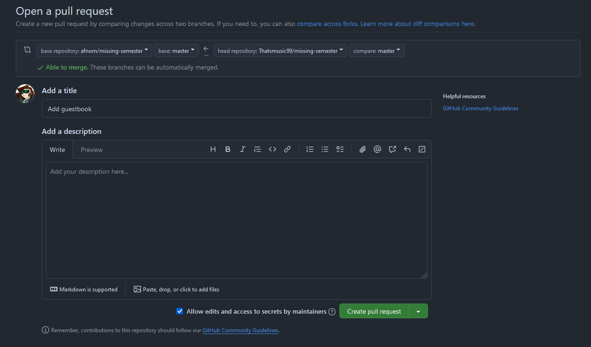
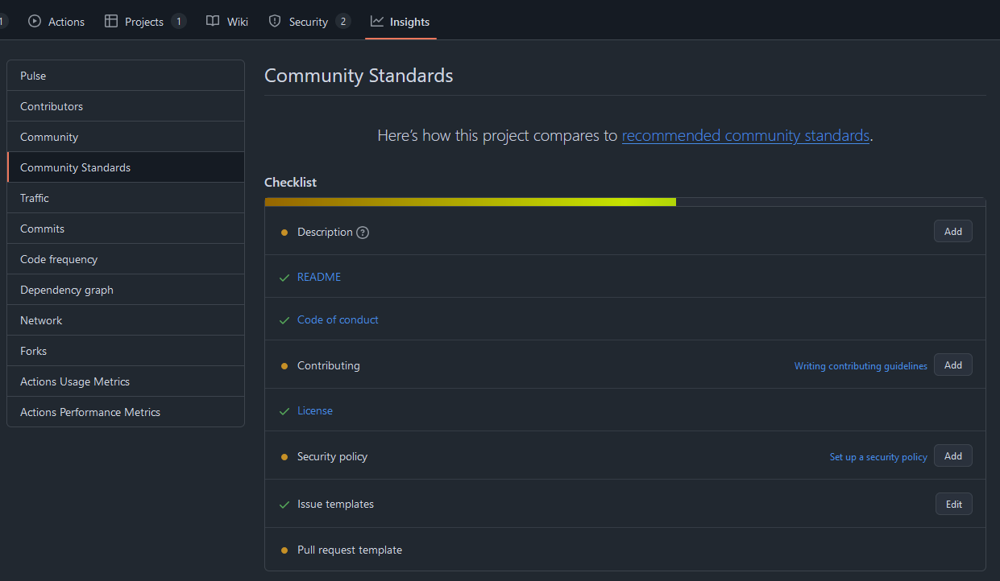
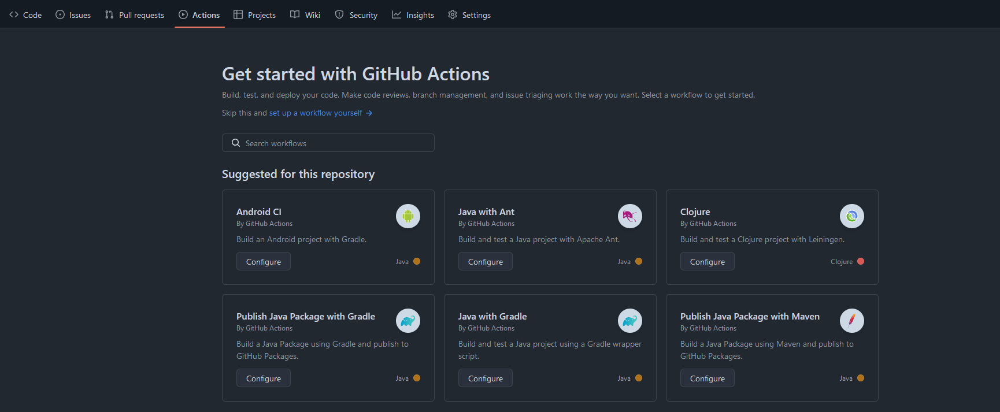

## 1. Introduction
This talk assumes knowledge of [Abi's Git talk](https://missingsemester.afnom.net/2024/version_control/) from earlier
this semester - prior to the talk, I would highly recommend refreshing your knowledge on Git itself just to make following
along easier.

This talk covers a bit more about using Git for contributing to open source, one of its most popular uses to date. Sites
like GitHub and Gitlab have connected millions of developers and nourished numerous open-source projects that have shaped
the software landscape that we know today. According to GitCharts (https://gitcharts.com/), a site that tracks GitHub's 
statistics, there are over 220 million public repositories, with 150,000 created each day and 450,000 forks created each 
day too. On June 4th 2018, Microsoft announced its acquisition of GitHub for $7.5 billion dollars (in stock), reinforcing 
the company's stance on open source development - without GitHub's impact, it's entirely possible that a competitor like 
Gitlab would've taken the torch GitHub currently holds and ran with it, but it's also not out of the question for the 
software landscape we know today to look incredibly different.

Due to its prosperity, this lecture will focus largely on GitHub and the tools it provides to developers, which should
help put into perspective how it's shaped open-source development throughout its reign. Thus, if you choose to follow
along, be sure to have a GitHub account, and if you're a student, you can take advantage of GitHub's education pack, a
pack that gives you access to JetBrain's innovative IDEs, free domain names provided by Namecheap, name.com or .TECH, and
if you choose to go down the route of payment processing for a project you have, waived transaction fees on Stripe.

You can read more about the Education pack here: https://github.com/education

We'll be focusing on both ends of open-source development, from making contributions to open source projects to maintaining
your own repository for contributions. As a demo, we'll open a pull request to our MS repository, writing our name to
the guestbook.

### Ways of Contributing and How to Start
First of all, let's start off with how contributions look on GitHub. Perhaps contrary to common belief, contributions on
GitHub are not limited to contributing code through PRs - you can submit issues, review other developers' code or even
contributing to documentation if you're not very confident with coding.

Some repositories will make use of a "good first issue" label, which will indicate what issues may be good for first-time
contributors to tackle. You can filter by that label and see what issue stands out to you, or has not been resolved yet.

Whilst the Missing Semester repository (UoB's version) doesn't make use of issues, other repositories like CSS' website
use them, so if you're looking to start somewhere, don't be afraid to take a look :)

## 2. Creating a fork
Creating a fork is relatively simple on GitHub and even other sites. There'll often be a "fork" button that you can
simply press:


Once you click on this button, you'll be presented with a screen to name your fork, a description of it and whether it
copies the main branch or not. Generally, this is fine to keep enabled, unless you look to contribute to a different 
branch on the main repository.

Once created, you'll then be able to clone your fork to work on it locally like a repository you've created yourself.

### Updating your fork with upstream
If you're updating software that has been abandoned, it's unlikely that you'd need to update your fork to be up to date 
with the original repository. However, if the original repository is still being maintained and updated, you may choose 
to update your fork with it. In this context, the original repository you forked from is known as "upstream".

GitHub and some other sites may have a simple "sync" button to do the update work for you, but it's good to know how to
manually do this, in case upstream commits break things in your fork. Some forks will have PRs opened to bring them up 
to date with their upstream.

In the command line, add a new remote called `upstream`:
```commandline
git remote add upstream https://github.com/afnom/missing-semester 
```
From there, fetch from upstream to ensure you're up to date:
```commandline
git fetch upstream
> remote: Counting objects: 75, done.
> remote: Compressing objects: 100% (53/53), done.
> remote: Total 62 (delta 27), reused 44 (delta 9)
> Unpacking objects: 100% (62/62), done.
> From https://github.com/afnom/missing-semester
>  * [new branch]      main     -> upstream/main
```
Switch to your fork's main branch (with main being the name of your main branch - it may vary):
```commandline
git checkout main
```
Then, you can merge with upstream:
```commandline
git merge upstream/main
> Updating 34e91da..16c56ad
> Fast-forward
>  README.md                 |    5 +++--
>  1 file changed, 3 insertions(+), 2 deletions(-)
```
There, you've updated your fork!

## 3. Committing Code with Visual Tools
You've been able to learn the foundations of Git itself, but it may be difficult to remember individual commands, or exercise
more control over what code you commit - thus, you may choose to use more visual tools to commit code.

A lot of modern IDEs will have some kind of integration with Git, such as IntelliJ or VSCode. However, there may be other
visual tools that you choose to use instead. For example, I used [GitHub Desktop](https://github.com/apps/desktop) when
I first started out. There's also the `gitk` command, which is provided with Git itself. If you run the command within a
folder hosting a repository, it'll open up a window that looks like this:


`gitk` is only for viewing commits rather than making them, and is very verbose - so it may be better for reviewing the
finer details of commits in a GUI.

## 4. Submitting a Pull Request
As mentioned prior, you'll often make a fork to contribute to the original work - and that's where pull requests come in.
They tend to have different names across different sites, since it's not necessarily a Git feature - Gitlab calls them
merge requests and Bit Bucket also calls them pull requests. Sometimes developers only address them as PRs as a shorthand, 
which I will do as well.

Once you've pushed your code, go to the main page of your fork, and check the "Contribute" button where it mentions your
branch being ahead of your upstream repository:


Then, click the "Open pull request" button. GitHub will then prompt you for the title of the PR, a description of what
the PR does, and the branches to merge into/from.



If you see the small dropdown arrow next to "Create pull request" too, you can create a pull request as a draft, meaning
that you've not completed your work yet, but can accept early review from maintainers or other contributors. 

### Best Practices
When making pull requests, different projects will have different ideals or requirements - and it extends to more than 
just making a good title and description. Here's a quick list of what you may find:
- Some repositories will not allow you to merge from your main branch. 
  - Ideally, it would come from a non-main branch where all of your work for that PR is focused.
- Some repositories may also not let you make a PR from a fork under an organisation.
  - You may remember the "Allow edits and access to secrets by maintainers" option? It doesn't apply to organisation forks.
  By consequence, project maintainers who want to edit your PRs to rebase or resolve nitpicks will ask for you to do them
  instead.
- PRs need a specific scope, e.g. if you intend on fixing a bug, it's only that bug you fix, rather than some formatting 
changes too.
- In addition to the above, depending on what is covered, PRs would ideally not be too big. Otherwise, they become too
cumbersome for maintainers to review.
  - They also increase the likelihood of complex merge conflicts that are a headache to resolve.
- Some repositories may require an issue to be opened before making a PR, which the PR then can link back to. This is
often for maintainers to give their stance on the issue and what can be done next.

### Merge Conflicts
After submitting your pull request, it's likely that other PRs will be accepted and merged in, or the main codebase is
changed over time. If those changes alter what your PR covers, that can result in merge conflicts, which maintainers may
request for you to resolve in order for them to accept the PR. Some simple ones can be resolved within GitHub - however,
more complex ones will have to be resolved locally.

Let's not only take an example, but *make* a merge conflict. I have the guestbook, and it currently looks like this after
switching to main:
```commandline
git checkout main
```
```markdown
---
layout: lecture
title: "Guestbook"
---

This guestbook was made for those participating in the "Git for Open Source Development" lecture in November 2024, to
demonstrate opening a pull request and contributing to an open-source project.
```
And I have a branch (`add-holly-to-guestbook`) to add myself:
```commandline
git branch add-holly-to-guestbook
git checkout add-holly-to-guestbook
```
With the guestbook content being:
```markdown
---
layout: lecture
title: "Guestbook"
---

This guestbook was made for those participating in the "Git for Open Source Development" lecture in November 2024, to
demonstrate opening a pull request and contributing to an open-source project.
- Holly, 4th Year MSci Computer Science
```
However, let's say someone else makes some changes to the guestbook content, and it ends up in main:
```markdown
---
layout: lecture
title: "Guestbook"
---

This guestbook was made for those participating in the "Git for Open Source Development" lecture in November 2024, to
demonstrate opening a pull request and contributing to an open-source project. Pls be nice

aaaaaa
a
a
```
Once I attempt to merge `add-holly-to-guestbook` into `main`:
```commandline
git checkout add-holly-to-guestbook
git merge main
```
It results in something that looks like this:

> Note: The conflicting branch here is `merge-conflict-test-2` - in our example, this would be `main`. `HEAD` is also a
> stand-in for `add-holly-to-guestbook` - it's just a slight difference in how I produced the conflict.

This is a merge conflict. This may look scary at first, and there is reason behind the chaos it spits out - here's the 
output we want to focus on:
```markdown
<<<<<<< add-holly-to-guestbook
demonstrate opening a pull request and contributing to an open-source project.
- Holly, 4th Year MSci Computer Science
=======
  demonstrate opening a pull request and contributing to an open-source project. Pls be nice

aaaaaa
a
a
>>>>>>> main
```

The conflict itself is encapsulated within the `<<<<<<<` and `>>>>>>>` arrows - but we may also choose to look outside of
this to gather further context about the conflict. Then, the two conflicting changes are separated by the equal signs
(`=======`). The first bit of code will often belong to the branch you're currently in (`add-holly-to-guestbook`, or 
when handling conflicts locally, `HEAD`), and the second bit will belong to the branch you're trying to merge with (`main`). 
There's a few things you can do with this information:
- Ditch the bottom code (`main`) and replace it with the code in `add-holly-to-guestbook`.
  - For example, you may choose to do this if you're working on a feature that makes the changes being conflicted with 
  redundant.
- Do the opposite and ditch the top code (`add-holly-to-guestbook`), replacing it with the code in `main`.
  - You may also choose to do this when you've made changes that are no longer needed, e.g. a fix in a function that was 
  deleted.
- Merge both changes together.

Let's say that the screaming at the end was unnecessary, but the "Pls be nice" was an important part of the change made.
However, the whole point of the `add-holly-to-guestbook` branch was to add my name to the guestbook, so we want to keep
it. Ultimately, we just change the content to mix the both together:
  
```markdown
<<<<<<< add-holly-to-guestbook
demonstrate opening a pull request and contributing to an open-source project. Pls be nice
- Holly, 4th Year MSci Computer Science
======= 
demonstrate opening a pull request and contributing to an open-source project. Pls be nice

aaaaaa
a
a
>>>>>>> main
```
Then, you can remove the arrows and equal signs that a part of the conflict, including the old bit of the conflict that
is now redundant:
```markdown
demonstrate opening a pull request and contributing to an open-source project. Pls be nice
- Holly, 4th Year MSci Computer Science
```
From there, you can commit and push your changes. Git will allow you to push as long as all conflicts are resolved.

If you're struggling with visualising conflicts and how to resolve them, IDEs will often try to help you along the way. 
For context, IntelliJ will often try to visualise merge conflicts by placing either content side by side, with your
final changes in the middle, then letting you choose which part of the conflict you want to merge in with.

### Code Reviews
After you've made a pull request, it will often be the case that maintainers will review it and suggest either code changes
or make general comments.

If you're a maintainer, you may get prompted for a review on each PR made to your project. To add a review, just switch
to the "Files changed" tab, then you can conduct a review:


As you go through each file, you can tick the "viewed" box to the right of the file, which will collapse it. If you need 
to make comments on certain lines, you can hover over the line numbers and click on the + icon that shows up, typing in
your thoughts. You can either add it as a single comment or start a review - if you want the comment to be a part of the
review, then use "Start a review", and the comment will appear once you click "Review changes" at the top, at which point
you can either approve the changes, comment on them without an explicit decision, or request changes.

When reviewing changes, it's good to be constructive if changes are required - if there are formatting-specific issues,
they should be verified as part of the CI/CD process. 

## 5. Setting up a Repository for Contributions
Now, let's move onto the maintainer's side of open source. GitHub has a community standards page in the Insights tab
of your project, which you can treat as a todo list for setting up a project for open-source contributions. Not all of
these are required for effective contribution, but some are vital, which I will go over below.



### README
A README file is often the very first file that someone will see when visiting your repository. It will often give a
quick overview of what the repository is, how to build/use it in development, and any other important links/bits of
information that would be useful to know. 

This file will often be called `README` or `README.md`.

### Code of Conduct
A code of conduct is used as a set of rules how to treat other developers working on a project. It's important to make
sure everyone who participates in contributing to a project doesn't feel ostracised or bullied. [As per Open Source Guide's 
guidance on code of conducts](https://opensource.guide/code-of-conduct/), It covers what is considered unacceptable 
behaviour, who it applies to, what happens when violations occur and how someone can report a violation.

GitHub will provide you with two default code of conducts if you're not sure how to write you own, which are the Contributor
Covenant (best for projects of all sorts of sizes), and the Citizen Code of Conduct (for large communities and events).

The code of conduct will often go into the root folder of your repository, called `CODE_OF_CONDUCT.md`.

### License
A license is one of the most important components of your project, since it legally dictates what other developers can
do with your work. There's a lot of licenses to choose from, but copyleft licenses tend to be found the most, which
require its derivative works (such as forks) to have the same rights as its own.

The three most common licenses that GitHub tend to push first are:
- Apache License 2.0 (this is what CSS' website is under)
- GNU General Public License v3
- MIT License

To put these three into perspective, MIT allows you to create forks or derivatives under different terms and without
publishing source code, GPLv3 requires derivatives to keep the same terms and have source code published, whilst the
Apache License focuses on the preservation of copyright. 

It's highly important to stress that none of this is legal advice - if in doubt, seek advice from an actual lawyer. Before
choosing a license too, I would highly recommend reading through each license to decide if it's the license you want to
use for your repository, and make your own choice.

The license will often go into the root folder of your repository, under the name `LICENSE`.

### Security Policy
Security policies are important for when users need to report security vulnerabilities, but want to report them 
responsibly - thus, only you know about the vulnerability, and you're given time to fix it. A security policy will often
consist of the following:
- Versions supported for security updates
- How to report security vulnerabilities

The security policy will often go into the root folder of your repository, named as `SECURITY.md`.

### Issue Templates and Forms
Issues can be immensely useful, but sometimes, you'll need additional information from those who submit those issues -
and sometimes, it will require the same information over and over, such as the version of the software being used, the
device it is used on, etc. - you can use issue templates for that.

Issue templates can be written in markdown, which will then be used as a template for anyone filling out an issue. These
go into the `.github/ISSUE_TEMPLATE` folders, and suffixed with a `.md`, e.g. `bug_report.md`. GitHub also provides
examples for bugs and features.

However, issue templates can be deleted be users reporting bugs, much to developers' demises - which is when issue forms
come in. These are a development in GitHub pretty much seen in every mainstream repository, enforcing you to fill out
certain fields and structure your report in a certain way. Instead of using .md files, issue forms are configured as
YAML files (i.e. `bug_report.yaml`). These are a bit too complex for us to cover this lecture, but I've linked the 
official documentation for [creating an issue form](https://docs.github.com/en/communities/using-templates-to-encourage-useful-issues-and-pull-requests/configuring-issue-templates-for-your-repository#creating-issue-forms)
from GitHub's documentation.

### Pull Request Template
Like with issue templates, you may choose to have pull request templates that require developers to fill out certain
information about their pull requests. However, unlike issue templates, these are far less common, presumably to be less
cumbersome for contributors to make PRs. PR templates may request the issue number that is resolved by the PR, a summary
or description of the PR, and tested environments.

Pull request templates go into the `.github/PULL_REQUEST_TEMPLATE` folders, and end with the `.md` suffix to signify
markdown.

### Repository Admin Accepts Content Reports
This is a simple toggle option that allows repository maintainers or administrators to receive reports from users about
content within the repository, and act on it accordingly. This is only particularly effective for larger projects, so
this may not be of particular concern for smaller projects you have.

## 6. CI/CD and GitHub Actions
If you're maintaining a repository, you'll often find occasions where someone contributes code to your repository, you
merge the changes in, just to find it completely breaks everything and the program no longer builds. Or even, another
maintainer pushes directly to main, but it breaks everything for everyone else, even if it works on their machine. If 
you're also building a website, you may want it to deploy automatically after each commit so that it's always up to date.
CI/CD can be used for all of this, 

CI/CD stands for continuous integration and development. GitHub allows for this quite easily, and additionally provides
pre-made workflows known as "Actions" for different checks or things you may want to do with your repository. For example,
let's say we want to test a Java project's compilation.

> For context, [this is a personal repository that I am using as an example.](https://github.com/Thatsmusic99/ItemsAPI)

Let's go into the Actions tab in the repository. When we go into the page, we're greeted with workflows that are suggested
for the repository:

However, as we scroll, we also happen to find workflow categories, such as:
- Deployment
- Security
- Continuous Integration
- Automation
- Pages

Generally, each workflow will have a target language, so not all of them may work for you.

Because our Java project uses Gradle for its dependency management, let's select the "Java with Gradle" workflow. When
we select it, this is the file generated:

```yaml
# This workflow uses actions that are not certified by GitHub.
# They are provided by a third-party and are governed by
# separate terms of service, privacy policy, and support
# documentation.
# This workflow will build a Java project with Gradle and cache/restore any dependencies to improve the workflow execution time
# For more information see: https://docs.github.com/en/actions/automating-builds-and-tests/building-and-testing-java-with-gradle

name: Java CI with Gradle

on:
  push:
    branches: [ "master" ]
  pull_request:
    branches: [ "master" ]

jobs:
  build:

    runs-on: ubuntu-latest
    permissions:
      contents: read

    steps:
    - uses: actions/checkout@v4
    - name: Set up JDK 17
      uses: actions/setup-java@v4
      with:
        java-version: '17'
        distribution: 'temurin'

    # Configure Gradle for optimal use in GitHub Actions, including caching of downloaded dependencies.
    # See: https://github.com/gradle/actions/blob/main/setup-gradle/README.md
    - name: Setup Gradle
      uses: gradle/actions/setup-gradle@af1da67850ed9a4cedd57bfd976089dd991e2582 # v4.0.0

    - name: Build with Gradle Wrapper
      run: ./gradlew build

    # NOTE: The Gradle Wrapper is the default and recommended way to run Gradle (https://docs.gradle.org/current/userguide/gradle_wrapper.html).
    # If your project does not have the Gradle Wrapper configured, you can use the following configuration to run Gradle with a specified version.
    #
    # - name: Setup Gradle
    #   uses: gradle/actions/setup-gradle@af1da67850ed9a4cedd57bfd976089dd991e2582 # v4.0.0
    #   with:
    #     gradle-version: '8.9'
    #
    # - name: Build with Gradle 8.9
    #   run: gradle build

  dependency-submission:

    runs-on: ubuntu-latest
    permissions:
      contents: write

    steps:
    - uses: actions/checkout@v4
    - name: Set up JDK 17
      uses: actions/setup-java@v4
      with:
        java-version: '17'
        distribution: 'temurin'

    # Generates and submits a dependency graph, enabling Dependabot Alerts for all project dependencies.
    # See: https://github.com/gradle/actions/blob/main/dependency-submission/README.md
    - name: Generate and submit dependency graph
      uses: gradle/actions/dependency-submission@af1da67850ed9a4cedd57bfd976089dd991e2582 # v4.0.0
```
Let's go over this bit by bit:
- We have a name specified for the workflow, this being "Java CI with Gradle" - this name will come up when you check
the Actions tab again.
- We've got the events for the workflow to be triggered listed, alongside the branches they should apply to. In this case,
the workflow should attempt to build the repository whenever pushes are made to the master branch, or pull requests 
targeting the master branch are made.
- We've got two jobs, one running the build step, the other generating a dependency graph of the project.
  - The build job has an environment configured, and requires permission to read the contents of the repository.
  - It checkouts the repository locally first before setting up JDK 17 and Gradle.
  - After that point, a build with the Gradle wrapper is attempted.
  - A lot of the steps for the dependency graph are the same - however, instead of setting up Gradle, it cuts straight
  to the dependency graph.

> There is a note in the workflow about using the Gradle wrapper - this is present in the repository, so we do not need
> the commented-out portion of the workflow.

However, if we want to test with multiple versions of Java, we can set up a matrix of versions to test against:
```yaml
jobs:
  build:
    name: Build on ${{ matrix.java-version }}
    runs-on: ubuntu-latest
    permissions:
      contents: read
    strategy:
      matrix:
        java-version: ['17', '21']

    steps:
    - uses: actions/checkout@v4
    - name: Set up JDK ${{ matrix.java-version }}
      uses: actions/setup-java@v4
      with:
        java-version: ${{ matrix.java-version }}
        distribution: 'temurin'
```
From there, the workflow will loop through each version and run the job with each one. You can then use the matrix
placeholder to represent each run.

You can also choose to run different jobs or steps depending on certain outcomes. For example, let's say we only want
our dependency graph job to run if the build job succeeded:
```yaml
jobs:
  # ...
  dependency-submission:

    runs-on: ubuntu-latest
    permissions:
      contents: write
    if: jobs.build.result == 'success'

```

GitHub has a full list of contexts that can be used in conditional statements 
[here](https://docs.github.com/en/actions/writing-workflows/choosing-what-your-workflow-does/accessing-contextual-information-about-workflow-runs).

Once you commit a workflow file, it will have to be on the main branch in order to run - workflow files in an alternative
branch will not run, including in PRs. 

You can read more about GitHub Actions [here](https://docs.github.com/en/actions).

## 7. Alternatives to GitHub
There are plenty of alternatives to GitHub itself, and there may be several reasons why you choose to not host your code
on GitHub. On some occasions it's down to preference, but there is also a movement to [give up GitHub entirely](https://giveupgithub.org)
due to concerns about Copilot being trained on GitHub projects without developers' consent, ties to the ICE in the USA, 
and the site itself being proprietary software that people have to rely on rather than being able to choose for themselves.

Although still proprietary, some alternatives you may have heard of include:
- [Gitlab](https://about.gitlab.com/)
- [BitBucket](https://bitbucket.org)

You can also self-host your Git hosts:
- [Gitlab Community Edition](https://gitlab.com/rluna-gitlab/gitlab-ce) - this one isn't proprietary.
- [Gitea](https://about.gitea.com/)

## 8. Final Thoughts
There's numerous features part of sites like GitHub and Gitlab that make contributing to open source projects far easier
and more streamlined. However, there's still plenty of things I haven't gone over - feel free to explore them in your own
time:
- Documentation for software, either using GitHub's wiki feature, [Gitbook](https://www.gitbook.com/) and many others.
- Adding maintainers to a repository, or requiring code reviewers through the CODEOWNERS file.
